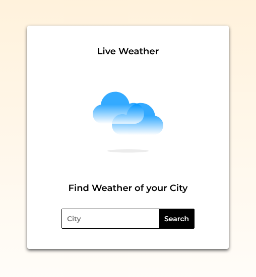
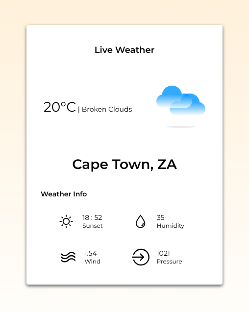

# 🌦️ Weather React App

A React weather app that shows the current weather for any city using the **OpenWeatherMap API**.


<p align="center">
  
  &nbsp;
  
</p>
<p align="center"><sub>Search screen and the result for Cape Town</sub></p>

## ✨ Features

- 🔎 Search for any city
- 🌡️ Current **temperature** and weather **description**, with an icon for the conditions
- 📍 City and country
- 📊 Extra details: **sunrise / sunset**, **humidity**, **wind** and **pressure**, each with its own icon

## 🛠️ Built With

- **React** (hooks)
- **styled-components** for component-level styling
- **Axios** for API requests
- **OpenWeatherMap Current Weather API**
- **gh-pages** for deployment to GitHub Pages

## 📁 Project Structure

```
src/
├── App.js                       # App shell and API call
├── models/
│   ├── CityComponent.js         # City search form
│   └── WeatherComponent.js      # Weather results display
└── index.js
public/icons/                    # Weather and info icons (SVG)
```

## 🚀 Getting Started

```bash
git clone https://github.com/Scarface96/weather-react-app.git
cd weather-react-app
yarn install
yarn start
```

Get a free API key from [OpenWeatherMap](https://openweathermap.org/api) and set it as `API_KEY` in `src/App.js`.

**Deploy to GitHub Pages:**
```bash
yarn deploy
```

## 📚 What I Learned

Fetching data from a third-party API, passing data between components, conditional rendering, and styling with styled-components.

---

👤 **Tony Mulunda** — [GitHub @Scarface96](https://github.com/Scarface96)
